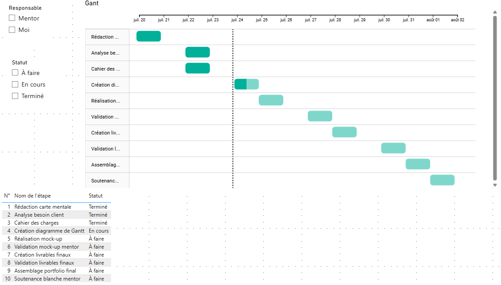

# Projet 13 – Créez votre portfolio de professionnel de la data

## &#128203; Scénario

Aéroworld, leader mondial de l’aéronautique, souhaite recruter un Data Analyst confirmé. Avant l’entretien, l’entreprise exige l’analyse de portfolios en ligne pour évaluer la maîtrise des outils, la gestion de projet et la capacité d’innovation des candidats.

## &#127919; Objectifs du projet

- Carte mentale du positionnement et des compétences
- Cahier des charges
- Analyse du besoin métier du client
- Diagramme de Gantt
- Mock-up de tableaux de bord
- Vidéo de formation
- Documentation synthétique accompagnant les livrables

## &#128295; Outils utilisés

- **Miro** : Pour les mock-ups des tableaux de bord et la carte mentale
- **Power BI** : Pour le diagramme de Gantt et les tableaux de bord
- **OBS Studio** : Pour l’enregistrement de la vidéo de formation

## 💡 Soft Skills

- Gestion de projet
- Sens de l’analyse et de la synthèse
- Communication pédagogique (explications, vidéo)
- Capacité d’organisation
- Esprit d’innovation et autonomie

## &#127891; Compétences acquises

- Analyse du besoin client et réécriture de demandes métiers
- Construction de plans de projet (Gantt, cahier des charges)
- Réalisation de mock-ups (cartes mentales, dashboards)
- Création de tableaux de bord dynamiques (Power BI)
- Mise en place de supports de formation vidéo
- Documentation claire des solutions proposées

## 1. Carte mentale et demande du client

## 2. Veille métier :
[Projet de veille sur GitHub](https://github.com/Reyan-project/openclassroom/tree/main/projets/veille_metier)
[Projet de veille automatisé sur GitHub](https://github.com/Reyan-project/openclassroom/tree/main/.github/workflows)

## 3. Livrables demandé :

- [Analyse du besoin métier client (PDF)](./docs/Analyse%20des%20besoins%20métiers.pdf)
- [Cahier des charges (PDF)](./docs/cahier_des_charges+-fonctionnel.pdf)
- [Mock-up carte mentale (PDF)](./docs/mind%20map.pdf)
- [Mock-up de tableaux de bord (PDF)](./docs/projet%20tableau%20de%20bord.pdf)
- [Vidéo de formation](./docs/video%20tuto%20power%20bi.zip)

### 🎯 Pour visualiser les livrables, consultez les images ci-dessus ou cliquez sur chaque lien pour télécharger le livrable correspondant.
