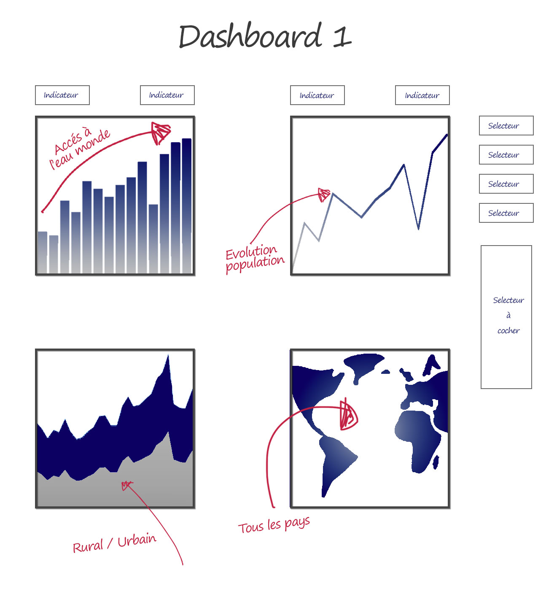

# Projet 10 : étude sur l'eau potable avec Power BI

## &#128203; Présentation du sujet

### Contexte
Nous sommes consultant Data Analyst data analyst en mission dans l’ONG DWFA (Drinking Water For All) ; elle a pour ambition de donner accès à l’eau potable à tout le monde.
DWFA présente 3 domaines d’expertise :
1. Création de services d’accès à l’eau potable
2. Modernisation de services d’accès à l’eau déjà existants
3. Consulting auprès d’administrations/gouvernements à propos des politiques d’accès à l’eau

## Mock-up

 

## &#127919; Objectifs
Réaliser un **tableau de bord** permettant le suivie des différents projets dans le monde avec **Power BI**.
Pour cela, il nous faut un tableau de bord pour : 

1. Identifier les pays qui rencontrent des difficultés d’accès à l’eau potable.
1. Identifier ceux pour lesquels concentrer nos efforts.
1. 3 vues (continentale, national et mondial).
  

# Product Strategy Canvas

## Prétraitement des données

Toute la préparation des données a été effectuées dans **Power BI** 

## Tableau de bord

Le lien du fichier Power BI, dont les captures d'écran ci-dessous sont issues, est disponible [ici](./Sanitoral databoard.pbix).

### Tableau de bord vue continental avec selection

### Tableau de bord vue continental sans selection

### Tableau de bord vue national avec selection

### Tableau de bord vue national sans selection

### Tableau de bord vue national avec selection

### Tableau de bord vue national sans selection

