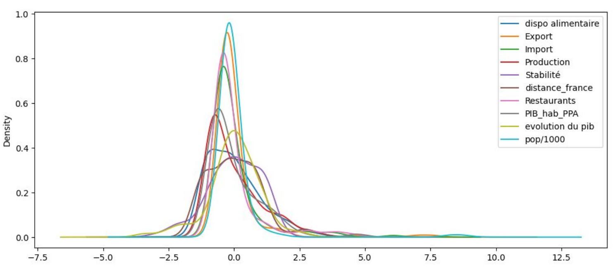
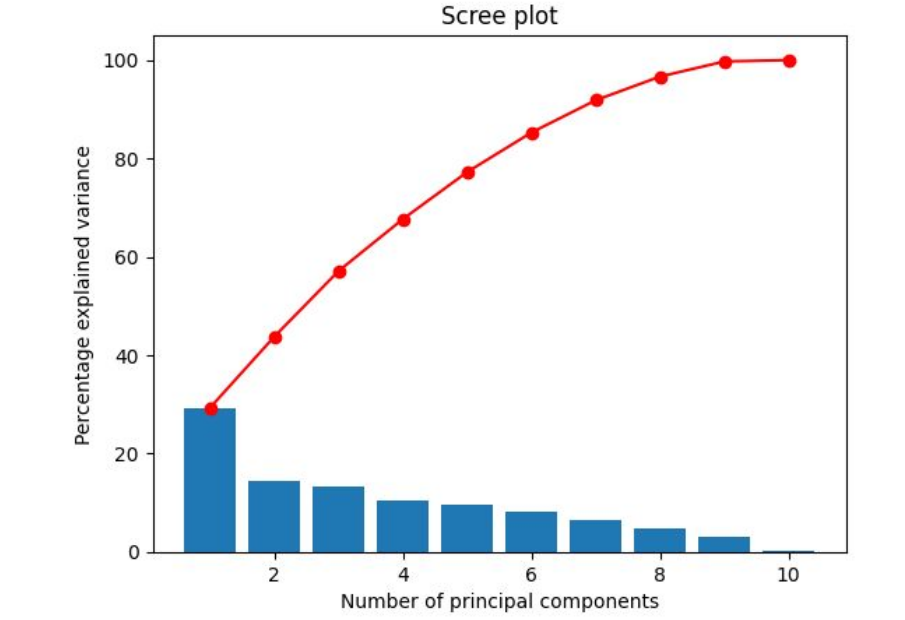
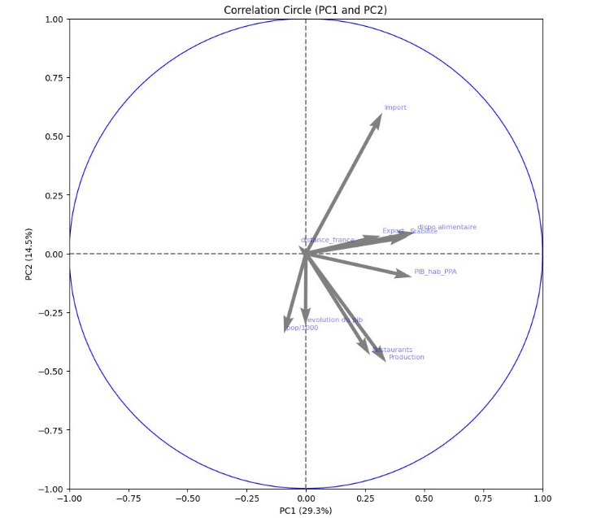
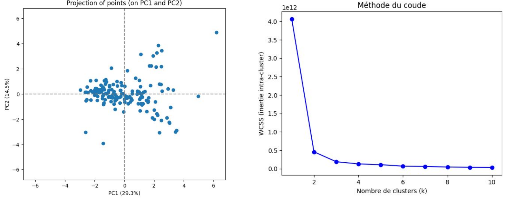
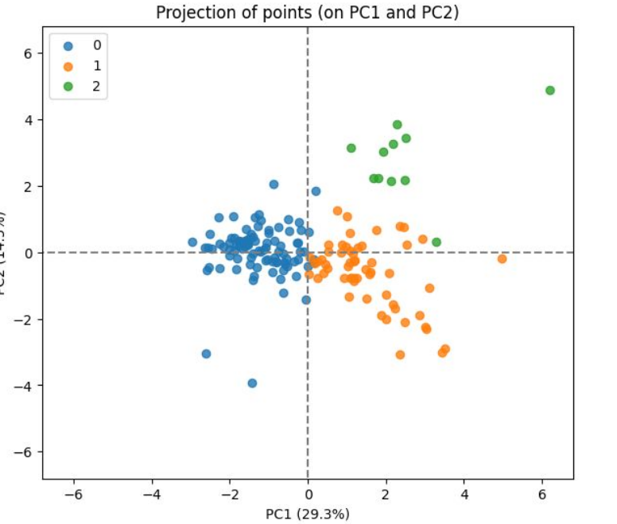
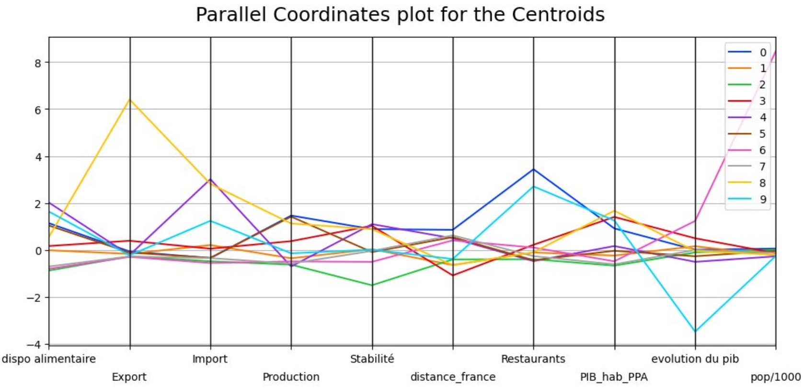
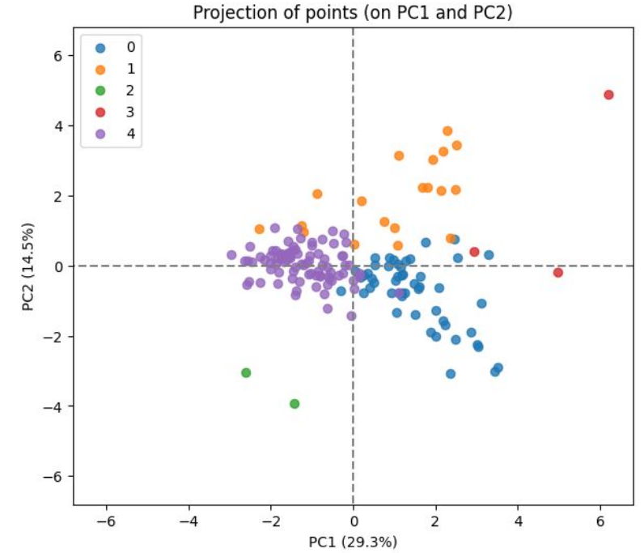
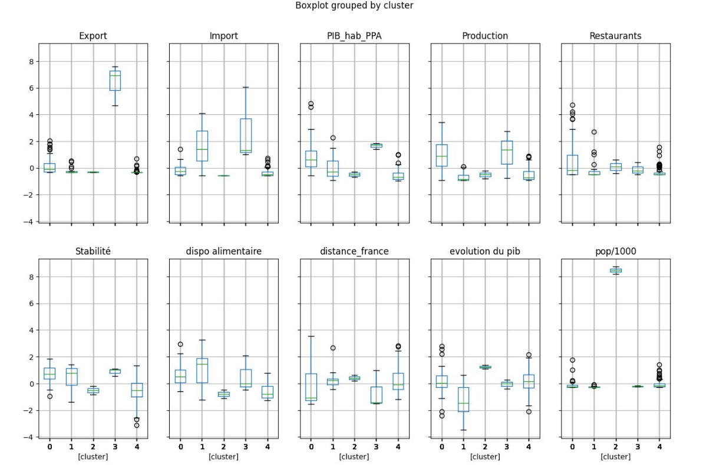

# Projet 11 : Produisez une étude de marché avec Python

## &#128203; Scénario
Nous sommes en poste chez **La poule qui chante**, une entreprise française d’agroalimentaire qui souhaite se développer à l'international. Cependant, la liste des pays potentiels dans lesquels s'implanter est longue. Pour cela, nous allons réaliser une analyse des groupements de pays que l'on pourra cibler grâce à différentes méthodes de *clustering*, puis nous approfondirons l'étude de marché.

## &#127919; Objectifs
* Préparer, nettoyer et réaliser une analyse exploratoire dans un *notebook* **Juypter** : 
Les données utilisées sont issues des [statistiques de la *Food and Agriculture Organization of the United Nations (FAO)*](https://www.fao.org/faostat/fr/#home). Elles nous permettront de définir les critères de l'analyse. Ces critères, seront appelés **indicateurs** dans la suite de l'étude.
* Réaliser le *clustering* des pays grâce à la classification ascendante hiérarchique (CAH) et à la méthode des k-means puis réaliser une analyse en composantes principales (ACP) dans un second *notebook*.

## &#128295; Outils utilisés
* **Pandas**, **Matplotlib** et **Seaborn** : préparation et analyse descriptive des données.
* **SciPy** et **scikit-learn**  : *clusterings*.

## 💡 Soft Skills
* Curiosité
* Autonomie
* Esprit de synthèse
* Clarté dans la présentation
  
## &#127891; Compétences acquises
* Effectuer un clustering simple.
* Explorer des données pour synthétiser des variables.

## Example d'analyses réalisées dans le *notebook* de *clusterings*

