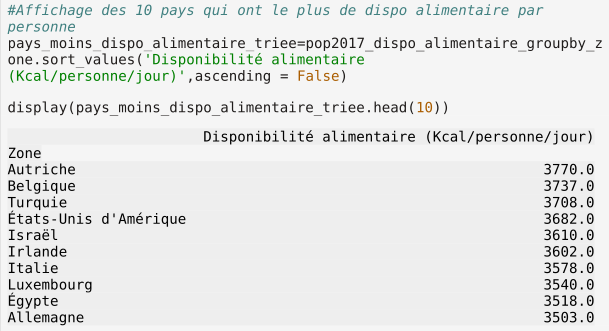
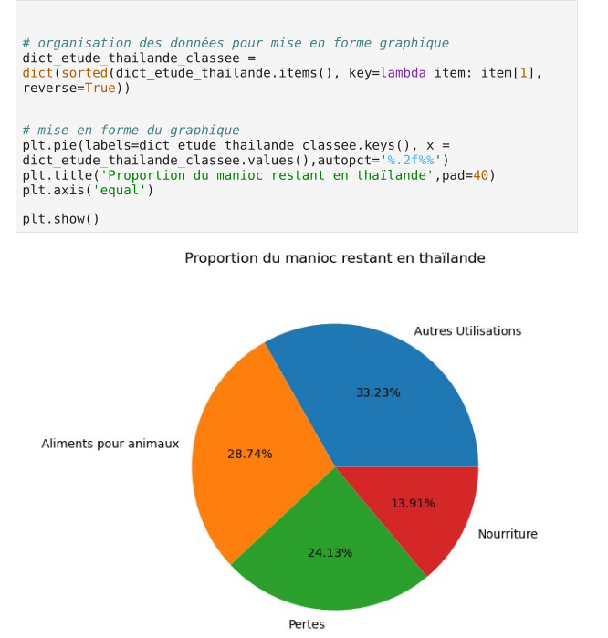

# Projet 4 : Réaliser une étude de santé publique

## &#128203; Scénario
Nous intervenons en tant que *Data Analyst* au sein d'une équipe de chercheurs de la *[Food and Agriculture Organization of the United Nations (FAO)](http://www.fao.org/home/fr/)* qui est une agence spécialisée de l'ONU menant des efforts internationaux vers l'élimination de la faim. 

## &#127919; Objectifs
Réaliser une étude sur le thème de la sous-nutrition et livrer nos analyses.

## &#128295; Outils utilisés
* **Pandas** : importation, préparation et vérification des données.
* **Pandas** et **Matplolib** : réalisation des analyses et visualisations.

## 💡 Soft Skills
* Esprit d’analyse
* Curiosité
* Rigueur scientifique
* Gestion du temps
* Communication vulgarisée

## &#127891; Compétences acquises
* Rédiger et présenter une méthodologie d'exploration et d'analyse des données.
* Utiliser des librairies spécialisées pour les traitements data.
* Manipuler des DataFrames.

## Examples d'analyses réalisées dans le *notebook*

