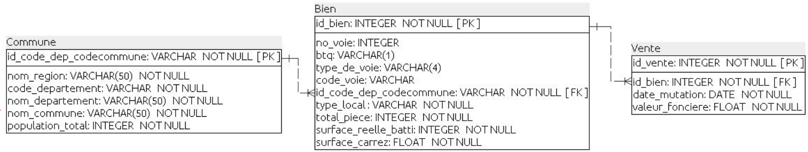
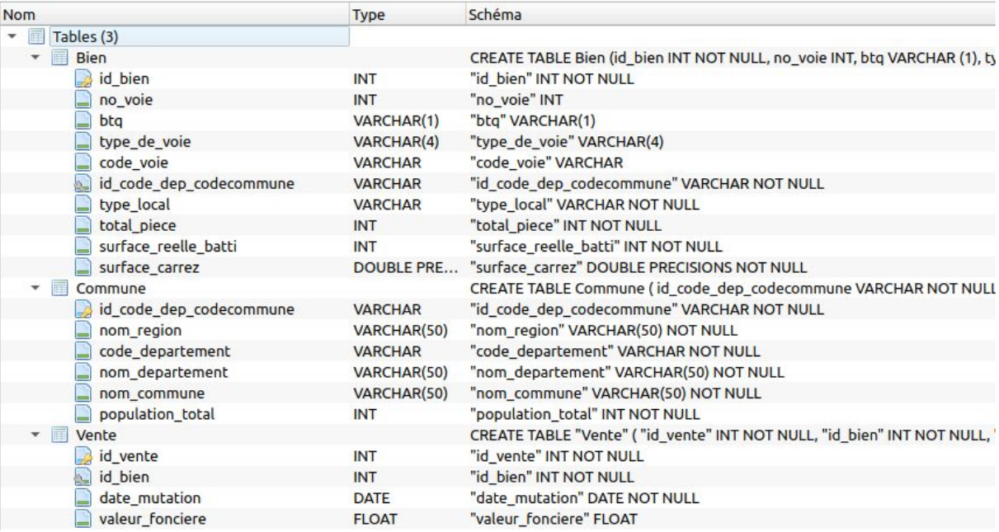
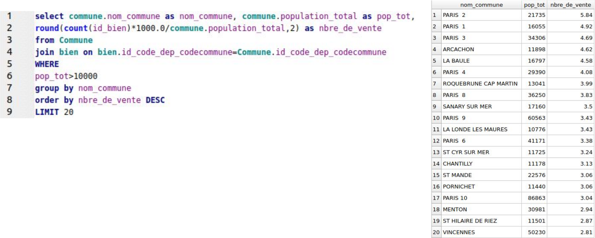

# Projet 5 : Créez et utilisez une base de données immobilière avec SQL

## &#128203; Scénario
Nous sommes *Data Analyst* chez Laplace Immo, un réseau national d’agences immobilières. Le directeur général est sensible depuis quelque temps à l’importance des données, et il pense que l’agence doit se démarquer de la concurrence en créant un modèle pour mieux prévoir le prix de vente des biens immobiliers. 

## &#127919; Objectifs
* Créer le dictionnaire des données et le schéma relationnel normalisé.
* Modifier la base de données permettant de collecter les transactions immobilières et foncières en France, puis implémenter cette nouvelle base de données et enfin effectuer les requêtes SQL nécessaires aux analyses.

## &#128295; Outils utilisés
* **Excel** : préparation des données.
* **SQL Power Architect** : modèle relationnel des données.
* **SQLiteStudio** : implémentation de la base et requêtes.

## 💡 Soft Skills
* Sens de l’organisation
* Précision
* Structure de la pensée
* Documentation
* Fiabilité
   
## &#127891; Compétences acquises
* Mettre à jour un catalogue de données.
* Créer des tables dans une base de données.
* Effectuer des requêtes SQL pour répondre à une problématique métier.
* Créer le schéma d'une base de données.
* Charger des données dans une base de données.

## Modèle relationnel des données

## Base de données implémentée dans SQLiteStudio

## Exemple de requête :

