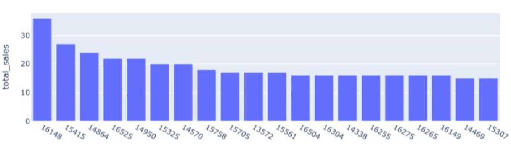
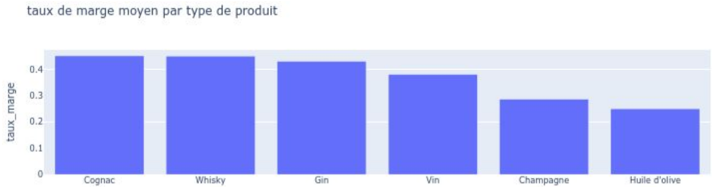

# Projet 6 : Analyser les ventes d'un marchand de vin avec Python

## &#128203; Scénario
Nous sommes consultant *Data Analyst* chez BottleNeck, un marchand de vin prestigieux. Problème a la gestion, l'analyse des données et gestion des stocks complexes.

## &#127919; Objectifs
* *Obtenir un jeu de données exploitables à partir des fichiers source, puis réaliser une analyse complète : detecter les erreurs de saisies, analyser les erreurs de prix.
* chiffres clés: CA par produit et total général, Top 20/80, analyser l'etat les taux de marges, la rotation des stocks et le nombre de mois de stock.

## &#128295; Outils utilisés
* **Pandas** et **Numpy** : importation, préparation, nettoyage des données.
* **plotly** et **seaborn** :  visualisations.

## &#127891; Compétences acquises
* Gérer une base de données, les erreurs de saisies, les outliers, et connecter plusieurs bases ensembles.
* Faire des graphiques et des recherches de demande spécifiques.

## Examples d'analyses réalisées dans le *notebook*

