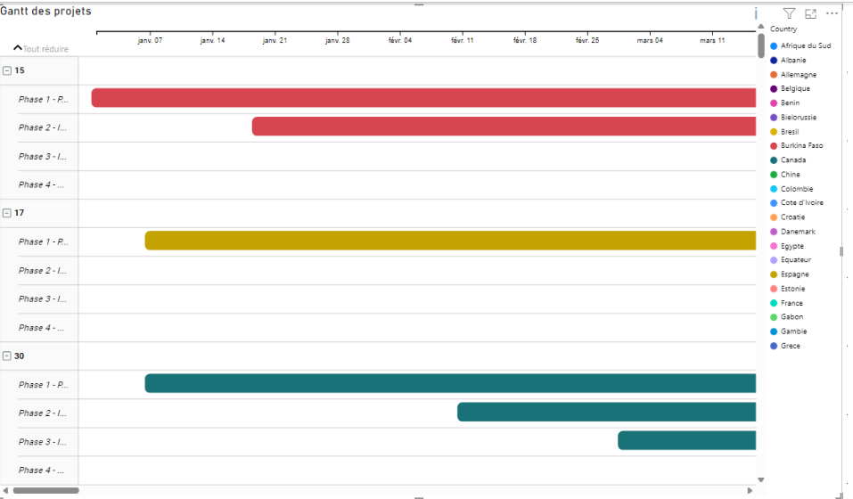
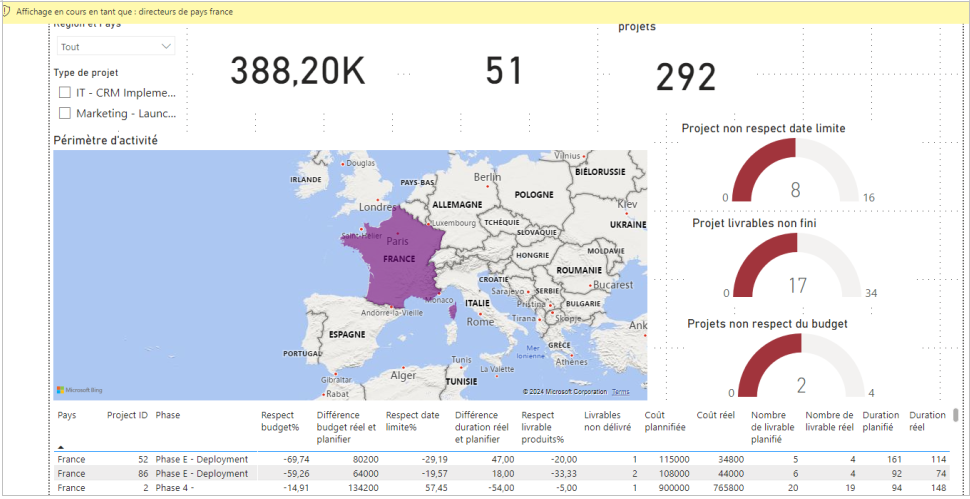
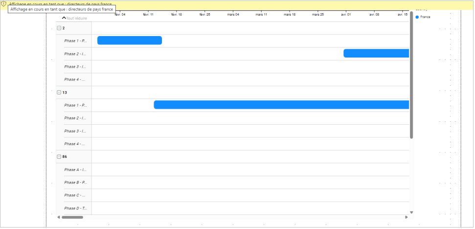

# Projet 7 : visualisation de données avec Power BI

## &#128203; Présentation du sujet

### Contexte
Nous sommes consultant Data Analyst chez Sanitoral pour réaliser une mission de visualisation de données. Il s’agit d’une société internationale qui fabrique et commercialise des soins bucco-dentaires. 

 
## &#127919; Objectifs
Réaliser un **tableau de bord** permettant le suivie des différents projets dans le monde avec **Power BI**.
Pour cela, il nous ai demaindé :
1. suivre l'avancement des projets et les coûts,contrôler les performances,identifier les retards 
1. Créé le Product Strategy Canvas
1. Prétraiter les données qui seront ensuite utilisées dans Power BI.
1. Créer le tableau de bord.

## &#128295; Outil utilisé
Power BI

## 💡 Soft Skills
* Sens de la synthèse
* Visualisation claire
* Pédagogie
* Orientation client
* Ecoute des besoins

## &#127891; Compétences acquises
* Data visualisation
* Indicateurs clés (KPI)
* DAX
* Interactivité

# Product Strategy Canvas

| **Rédacteur**                | Data Analyst, ESN                      |
|------------------------------|----------------------------------------|
| **Date**                     |                                        |
| **Nom du client**            | Sophie, cheffe de projet au sein du service Project Management Office de Sanitoral |

## Note de cadrage

Veuillez vous appuyer sur la note de cadrage de la mission pour remplir le tableau ci-dessous.

| **Nom du tableau de bord**   |                                        |
|------------------------------|----------------------------------------|
| **Objectif du dashboard**    | suivre l'avancement des projets et les coûts ; - identifier les retards ; - contrôler les performances, afin que l’équipe puisse mener les actions adéquates. |

---

## Utilisateurs & User Stories

### Utilisateur 1 : Directeur général

- **User story 1**  
  _En tant que directeur général j’aimerai un tableau de bord pour pouvoir voir les différentes avancées des projets marketing et IT._  
  **Indicateurs clés :**  
  - coûts du projet  
  - respect des deadlines des projets  
  - livrables produits par les projets par rapport au planning

- **User story 2**  
  _En tant que directeur général, j’aimerai être alerté lors d’écart de performance (15 % de différence entre le prévisionnel et l’actuel sur l’un de ces indicateurs doit conduire à une alerte) pour pouvoir décider l’arrêt ou la poursuite des projets._

- **User story 3**  
  _En tant que directeur général, j’aimerai simplement voir et compter le nombre de projets en alerte pour pouvoir mieux organiser mes priorités._

---

### Utilisateur 2 : Directeurs régionaux

- **User story 4**  
  _En tant que directeur régional, j’aimerai un tableau de bord pour pouvoir voir les différentes avancées des projets marketing et IT de ma région._  
  **Indicateurs clés :**  
  - coûts du projet  
  - respect des deadlines des projets  
  - livrables produits par les projets par rapport au planning

- **User story 5**  
  _En tant que directeur régional, j’aimerai être alerté lors d’écart de performance pour pouvoir les suivre._

- **User story 6**  
  _En tant que directeur régional, j’aimerai simplement voir et compter le nombre de projets en alerte dans ma région pour pouvoir mieux organiser mes priorités._

---

### Utilisateur 3 : Directeurs de pays

- **User story 7**  
  _En tant que directeur de pays, j’aimerai un tableau de bord pour pouvoir voir les indicateurs clés des projets sur leur pays._  
  **Indicateurs clés :**  
  - coûts du projet  
  - respect des deadlines des projets  
  - livrables produits par les projets par rapport au planning

- **User story 8**  
  _En tant que directeur pays, j’aimerai une vision globale du pays pour pouvoir prendre les mesures correctives nécessaires._

- **User story 9**  
  _En tant que directeur pays, j’aimerai simplement voir et compter le nombre de projets en alerte dans mon pays pour pouvoir mieux organiser mes priorités._

## Prétraitement des données

Toute la préparation des données a été effectuées dans **Power BI** 

## Tableau de bord

Le lien du fichier Power BI, dont les captures d'écran ci-dessous sont issues, est disponible [ici](<Sanitoral databoard.pbix>).

### Tableau de bord Directeur général

### Gant Directeur général

### Tableau de bord Directeur pays France

### Gant Directeur pays France

