# Projet 9 : Analyser les ventes d'une librairie avec Python

## &#128203; Scénario
Nous sommes consultant *Data Analyst* rattaché au service Marketing chez Lapage, une grande librairie généraliste en ligne très réputée. Devant le succès de certains de ses produits et l’engouement de ses clients, elle a décidé d’ouvrir un site de vente en ligne. Nous intervenons car l’entreprise souhaite faire le point après deux ans d’exercice.

## &#127919; Objectifs
Obtenir un jeu de données exploitables à partir des fichiers source, puis réaliser une analyse complète : chiffres clés, KPI, graphiques, etc.. Nous réalisons également plusieurs tests statistiques afin de vérifier la corrélation entre différentes variables liées au profil des clients.

## &#128295; Outils utilisés
* **Pandas** : importation, préparation, nettoyage des données.
* **Pandas** et **Matplolib** : réalisation des analyses et visualisations.
* **SciPy** : tests statistiques (corrélations profil client/comportement)

## 💡 Soft Skills
* Esprit d’analyse
* Orientation business
* Communication claire

## &#127891; Compétences acquises
* Réaliser un test statistique.
* Réaliser une analyse bivariée pour interpréter des données.
* Analyser des séries temporelles.

## Examples d'analyses réalisées dans le *notebook*
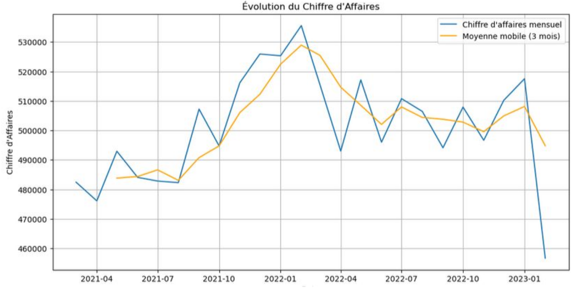

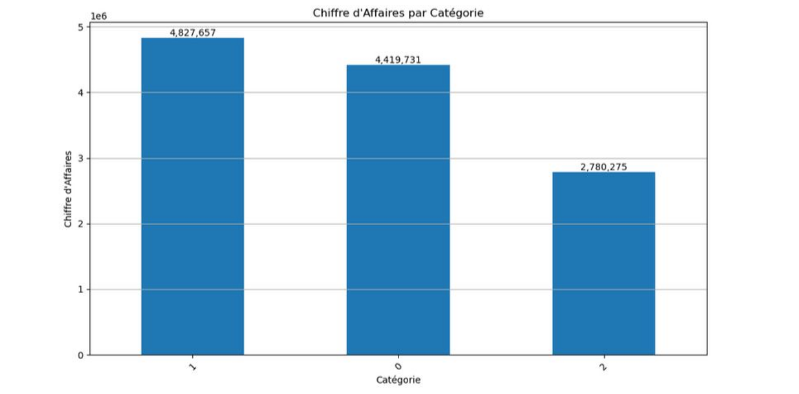

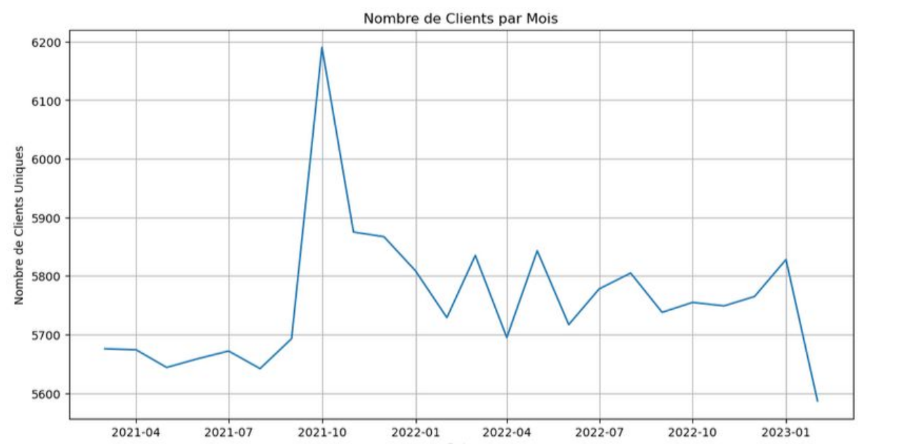

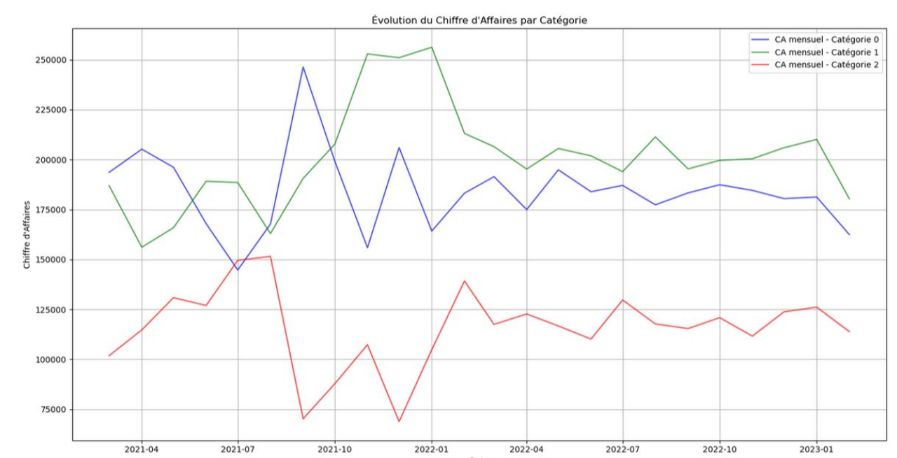

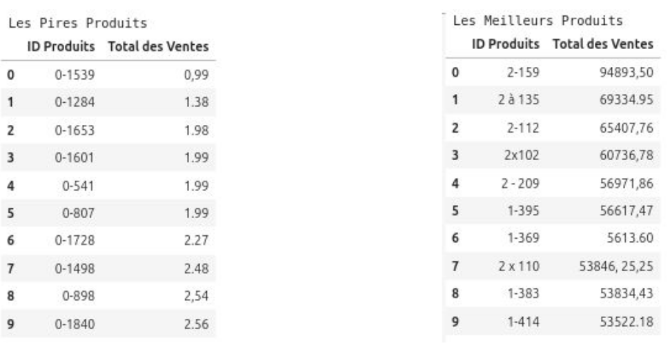

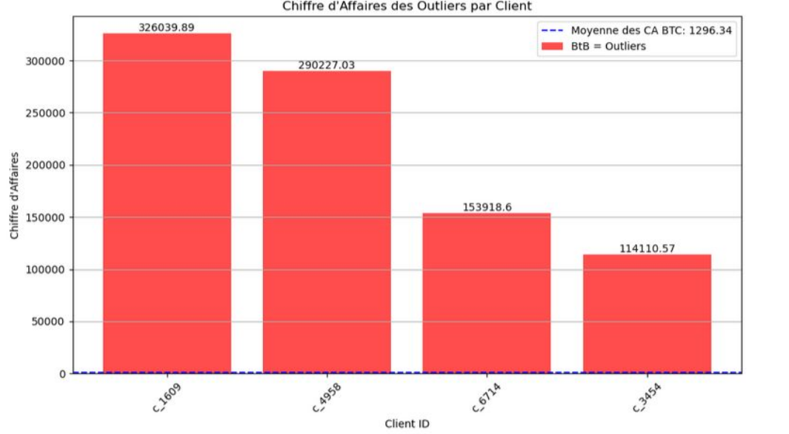

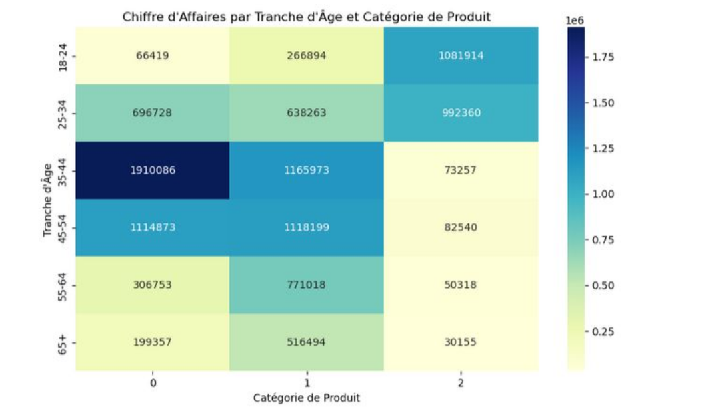

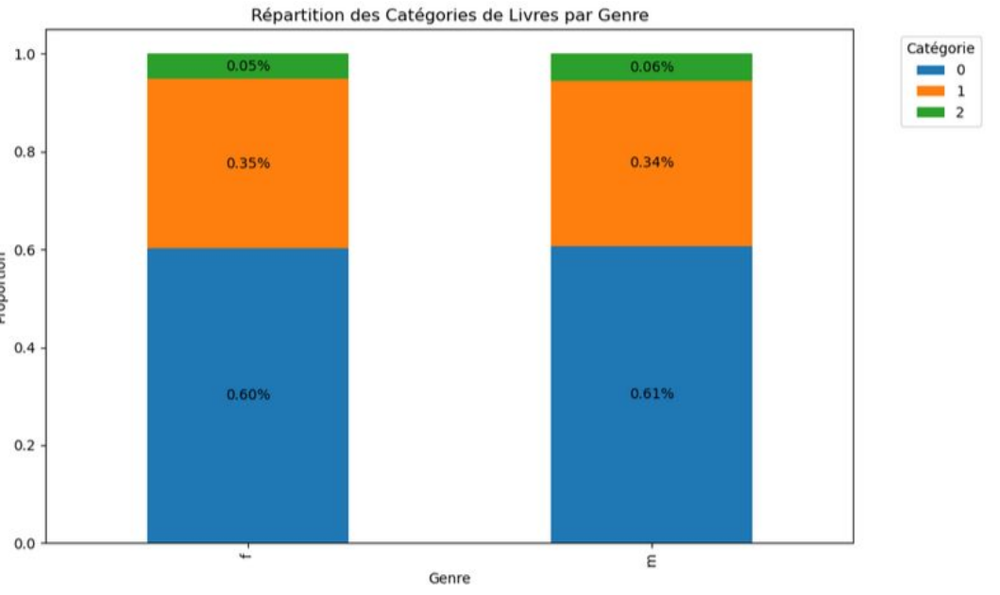

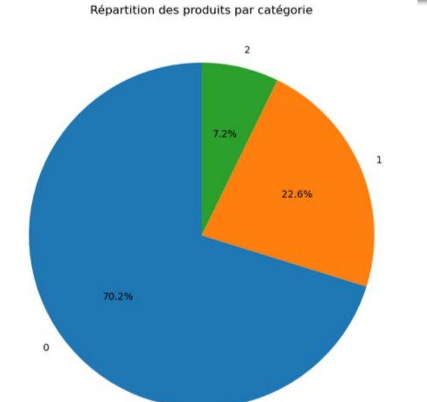

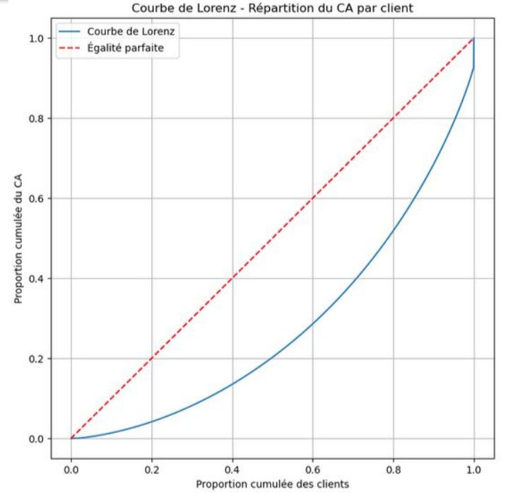

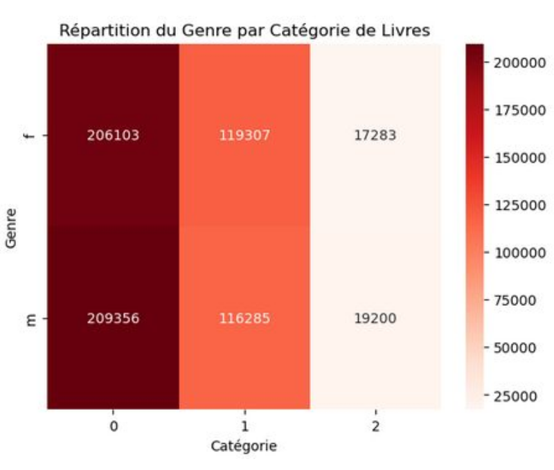

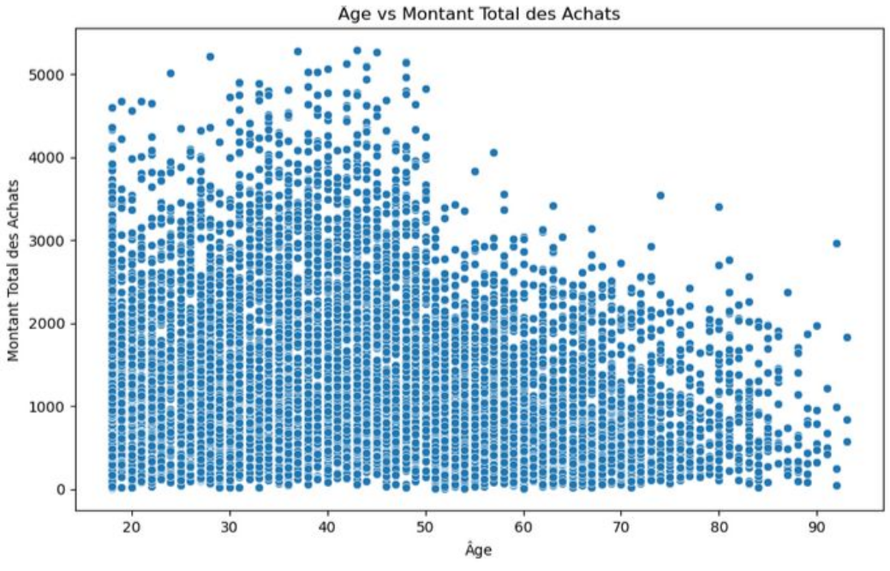

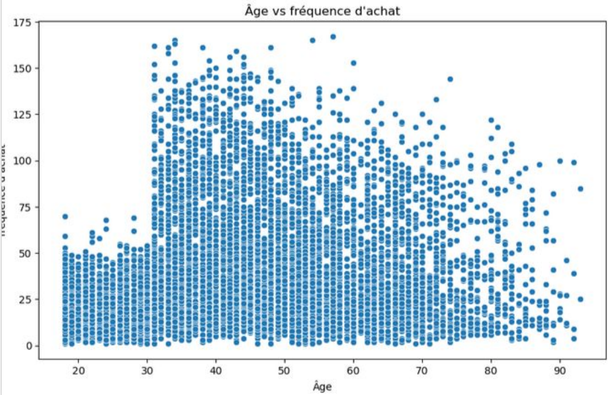

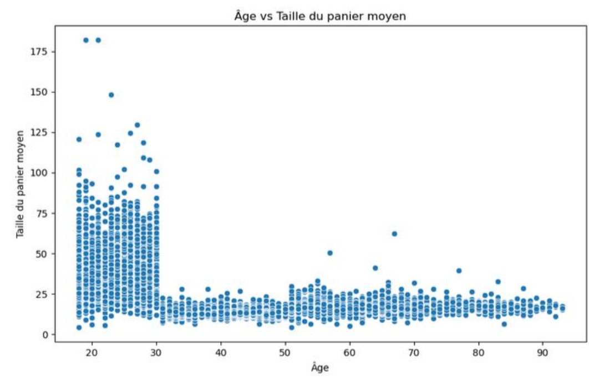

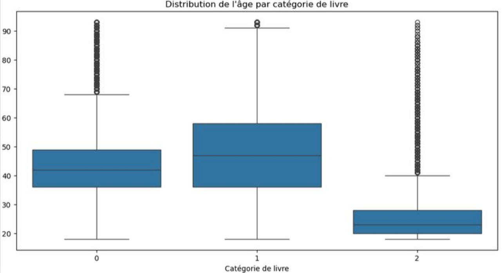
